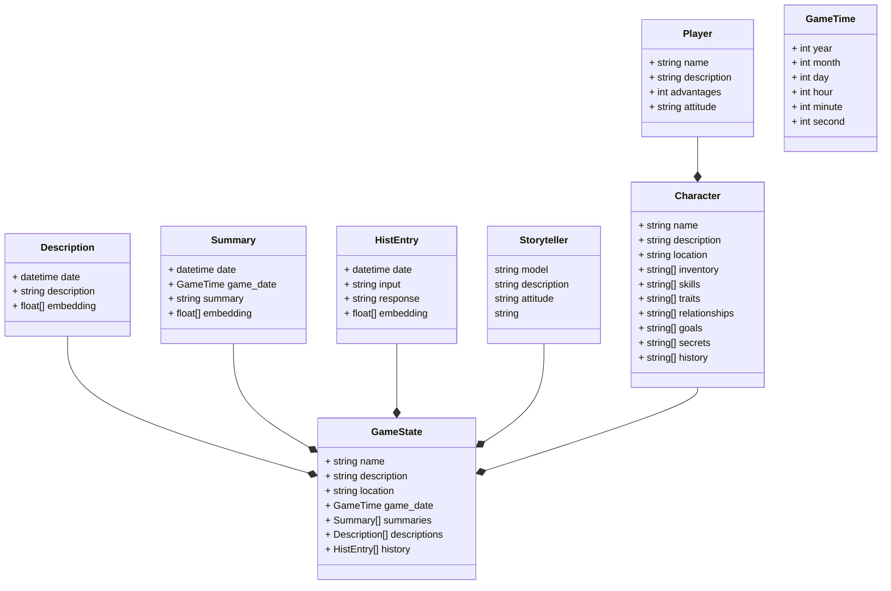

# design
Diagram around the design of the project. This is a work in progress.

class diagram

One of the ideas in this is to have the Storyteller take into account the attitude of the player and work with (or against) them based on how well intentioned they are. Basically I want to make the Storyteller a bit of a jerk if the player is a jerk.

Creative prompt building will be the key in this project. How do we give the LLM the right context to continue an interaction while supplying the most relevant history?

Does the character have the skills and equipment to pull off whatever the player is asking? Even if they don't, maybe it's a calculated risk to learn the skill if successful. There are tons of possibilities here, but of course, each question is potentially a new prompt and a new response, and costs resources/time.
